### 2.1.1. 부품 구성 확인 (1.png)

조립 전 핵심 주의사항

1. STS3215 서보 6개는 조립 전에 **ID 1~6**으로 각각 설정합니다.
2. 각 서보는 조립 전에 **절대 위치 2047**로 맞춥니다.
3. 조립 후 케이블을 연결하기 어려운 경우가 많으므로, 필요한 케이블은 **미리 연결**합니다.
4. 서보혼은 기계적 톱니 정렬 특성상 완전히 이상적인 각도로 맞지 않을 수 있으며, 이후 **오프셋 조정**으로 보정합니다.

jdcobot200을 조립하기 전에 사용되는 부품을 모두 확인합니다. 다음 부품이 있어야 합니다.

1. base plate
2. base link
3. base top
4. shoulder joint
5. shoulder link
6. arm_link 2개
7. wrist_link
8. gripper base
9. gripper left
10. gripper right main part
11. gripper right cover part
12. shoulder joint용 베어링 6706
13. gripper right용 베어링 6800ZZ 2개
14. Feetech STS3215 12V 1/345 6개
15. USB-c 케이블
16. Waveshare STS3215 인터페이스 보드
17. 12V 5A 전원 어댑터
18. 와이어 커버 6개
19. M2x6 와이어 커버용 탭핑 나사 12개
20. base top - base link - base plate 고정 볼트 4개 M5x50
21. 21번용 너트 M5 4개
22. shoulder joint - shoulder link 결합용 M2x8 나사 7개

현재 여기에는 카메라 부품은 빠져 있습니다.

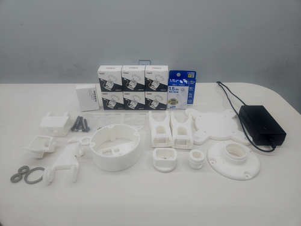
---

### 2.1.2. 서보 ID 설정 및 중심점 정렬 (2.png)

제일 먼저 사용할 Feetech STS3215 모터 6개에 ID를 부여합니다.

그리고 각 모터의 중심점을 2047로 맞춥니다.

이렇게 하는 이유는 STS3215는 ID를 변경할 수 있고, 공장 출하 시 기본값이 1번으로 설정되어 있기 때문입니다.

여러 개의 서보를 연결할 때 같은 ID가 있으면 제대로 동작하지 않으므로, 조립 전에 ID를 1~6까지 각각 설정합니다.

절대 위치를 2047에 맞추면 조립 후 서보 실제 위치와 로봇 기준 위치의 차이를 줄일 수 있어, 이후 제어용 오프셋 값이 작아지고 프로그래밍이 쉬워집니다.

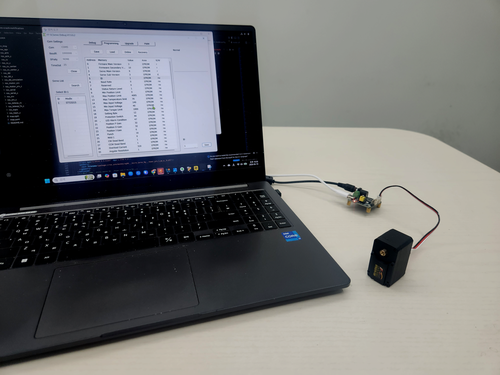

---

### 2.1.3. 서보혼 기본 방향 조립 (3.png)

서보모터 위치를 2047로 맞췄다면, 이후 대부분의 조인트에서 서보혼을 그림과 같은 방향으로 조립합니다.

서보혼과 서보가 약간 어긋난 상태로 결합될 수 있으며, 이 때문에 나중에 로봇암을 조립한 후 오프셋 조정이 필요할 수 있습니다.

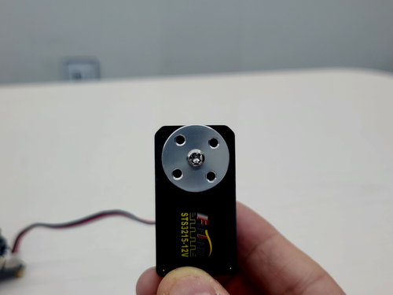
---

## 베이스 모듈 조립

### 2.1.4. 베이스 모듈 부품 준비 (4.png)

이제 베이스 모듈을 조립합니다. 필요한 부품은 다음과 같습니다.

1. 베이스 플레이트
2. 베이스 링크
3. 베이스 탑
4. STS3215 서보 및 서보혼 나사류
5. 베이스 고정용 볼트/너트 4개

서보모터 조립에 필요한 나사류는 모두 서보 패키지에 동봉되어 있습니다.

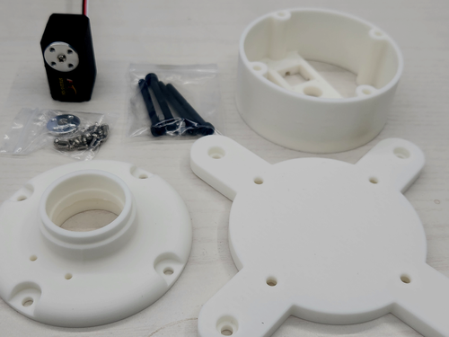

---

### 2.1.5. 베이스 서보 케이블 선연결 (5.png)

베이스 모듈을 조립하기 전에 STS3215에 두 개의 커넥터 케이블을 모두 연결합니다.

조립 후에는 연결이 어렵거나 불가능한 경우가 많습니다.

STS3215는 시리얼 버스 서보이므로 PC로부터 받은 시리얼 신호를 다음 서보로 그대로 전달합니다.

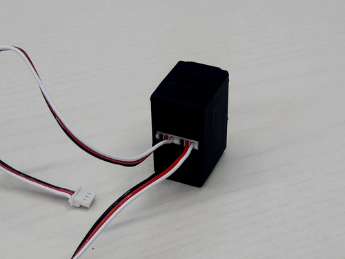

---

### 2.1.6. 베이스 링크에 서보 하부 고정 (6.png)

이번에는 서보의 바닥면을 베이스 링크에 조립합니다.

서보 패키지에 있는 M2x6 나사를 사용하고, 조립 위치와 방법은 그림을 참고합니다.

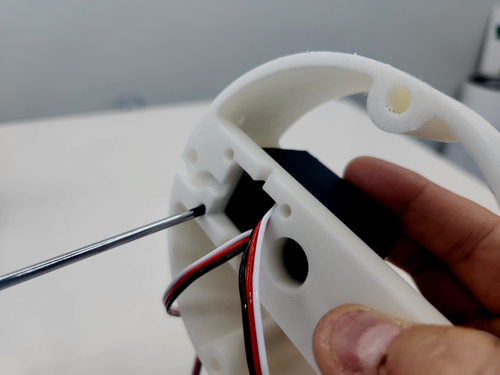

---

### 2.1.7. 베이스 서보 케이블 정리 (7.png)

서보를 베이스 링크 바닥에 4개의 나사로 조립한 뒤에는 케이블을 그림처럼 정리합니다.

왼쪽으로 빼 놓은 시리얼 케이블은 Waveshare 보드를 거쳐 PC로 가고, 아래쪽으로 뺀 케이블은 shoulder용 서보모터로 갑니다.

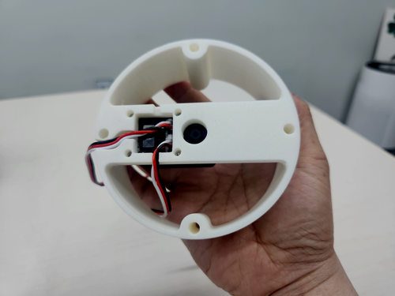

---

### 2.1.8. 베이스 모듈 전체 부품 준비 (8.png)

이제 베이스 모듈 전체를 조립합니다.

1. 베이스 플레이트
2. 베이스 링크
3. 베이스 탑
4. 베이스 파트 고정용 볼트/너트
5. STS3215 고정용 M2x6 나사

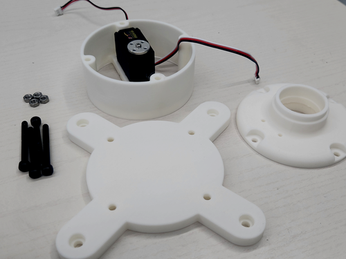

---

### 2.1.9. 베이스 플레이트와 베이스 링크 결합 (9.png)

베이스 플레이트와 베이스 링크를 조립합니다.

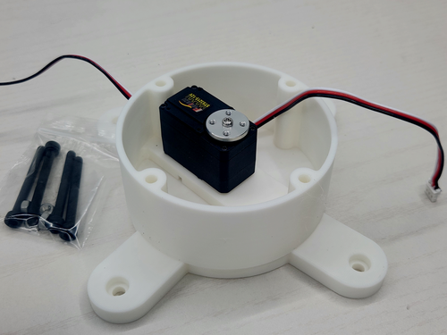

---

### 2.1.10. 베이스 탑 올리기 (10.png)

베이스 탑을 올립니다.

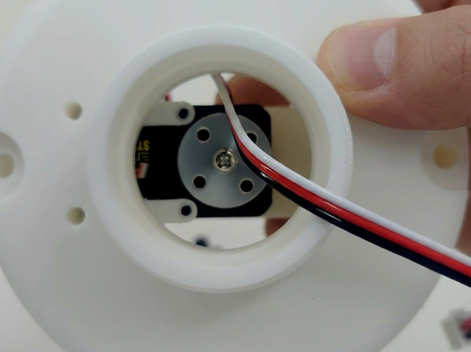

---

### 2.1.11. 베이스 볼트 체결 (11.png)

이제 베이스 플레이트, 베이스 링크, 베이스 탑을 볼트로 체결합니다.

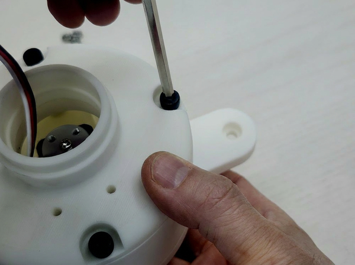

---

### 2.1.12. 베이스 서보 상부 고정 1 (12.png)

STS3215 서보의 윗면을 M2x6 나사로 고정합니다.

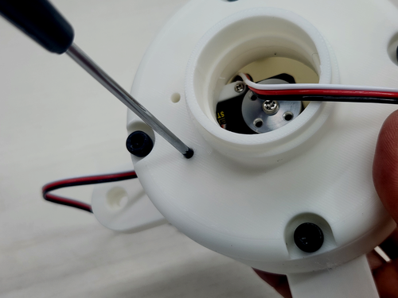

---

### 2.1.13. 베이스 서보 상부 고정 2 (13.png)

STS3215 서보의 윗면을 M2x6 나사로 고정합니다. 힘을 많이 받는 부분이므로 단단히 체결합니다.

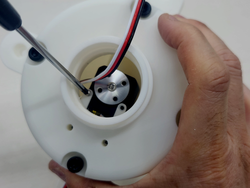

---

### 2.1.14. 베이스 모듈 상부 확인 (14.png)

이제 베이스 모듈 조립이 끝났습니다. 위에서 본 모습입니다.

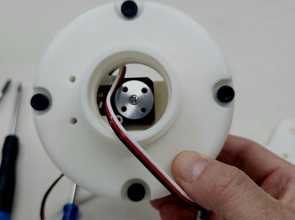

---

### 2.1.15. 베이스 모듈 측면 확인 (15.png)

조립된 베이스 모듈의 측면 모습입니다.

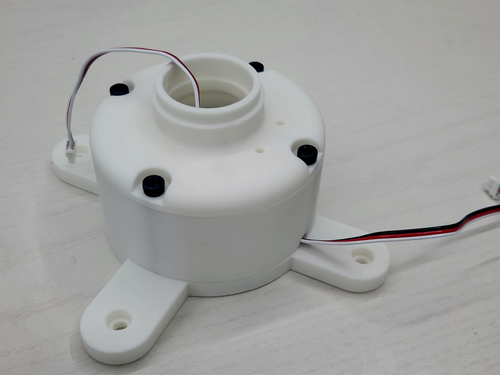

---

## 숄더 모듈 조립

### 2.1.16. 숄더 모듈 부품 준비 (16.png)

다음에는 shoulder 모듈을 조립합니다. 필요한 부품은 다음과 같습니다.

1. STS3215 shoulder용
2. shoulder joint
3. shoulder link
4. 베어링
5. shoulder joint와 shoulder link 결합용 M2x8 나사

shoulder joint는 베이스 서보와 숄더를 결합하는 부품이고, shoulder link는 숄더용 서보모터를 고정하는 부품입니다.

숄더 조인트와 숄더 링크는 M2x8 나사 7개로 고정됩니다.

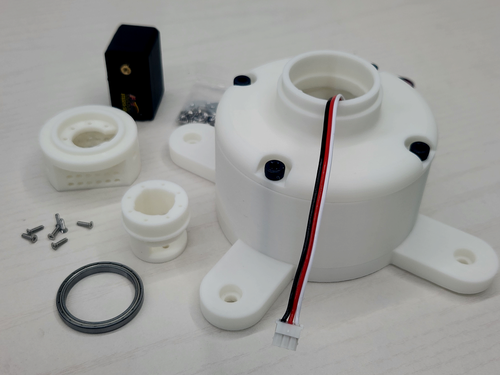

---

### 2.1.17. 숄더 조인트로 케이블 통과 (17.png)

먼저 숄더 조인트의 사이드 구멍으로 베이스 서보모터의 시리얼 케이블을 통과시킵니다.

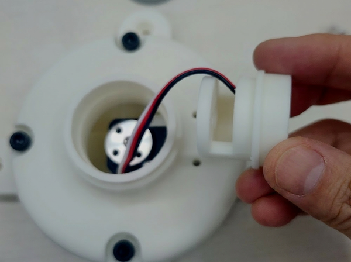

---

### 2.1.18. 숄더 조인트를 베이스 서보혼에 고정 (18.png)

이제 숄더 조인트를 베이스 서보혼에 고정합니다. 이때 주의할 점은 다음과 같습니다.

1. 베이스 서보는 2047 위치여야 합니다.
2. 베이스 서보혼은 **2.1.14 그림**과 같은 방향이어야 합니다. 그렇지 않으면 오프셋 값이 커져 로봇 제어가 어려워집니다.
3. 숄더 조인트의 사이드 구멍은 베이스 서보 고정 나사와 180도 반대 방향에 위치해야 합니다.

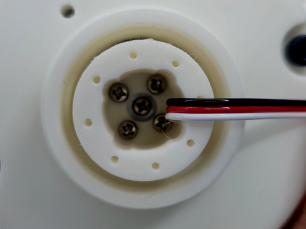

---

### 2.1.19. 베어링 삽입 (19.png)

베어링을 숄더 조인트와 베이스 모듈 사이에 끼웁니다. 끝까지 손으로만 넣기 어려울 수 있습니다.

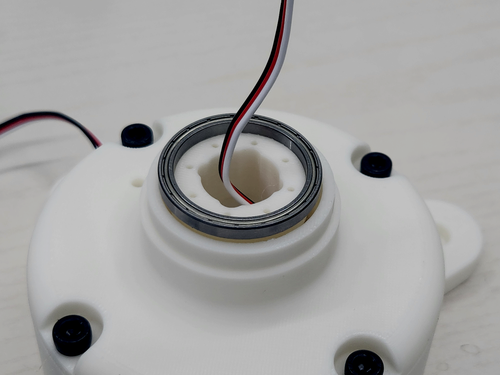

---

### 2.1.20. 숄더 링크로 베어링 눌러 조립 (20.png)

숄더 조인트 베어링을 숄더 링크로 위에서 조립하듯 힘을 주어 누르면 베어링이 제자리에 들어갑니다.

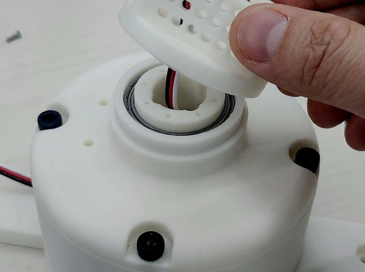

---

### 2.1.21. 케이블을 숄더 링크 뒤쪽으로 빼기 (21.png)

베어링이 제자리를 잡은 후, 숄더 조인트와 숄더 링크를 조립하기 전에 베이스 서보의 시리얼 케이블을 숄더 링크 뒤쪽의 작은 구멍을 통해 밖으로 빼냅니다.

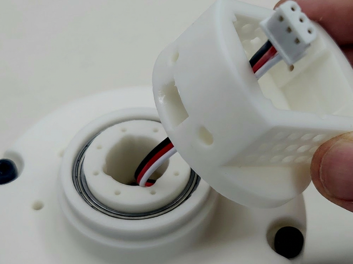

---

### 2.1.22. 케이블 인출 방향 확인 (22.png)

케이블은 그림과 같은 방향으로 빼면 됩니다.

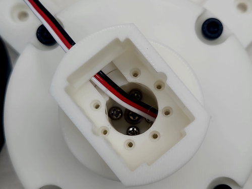
---

### 2.1.23. 숄더 조인트와 링크 체결 (23.png)

숄더 조인트와 숄더 링크를 7개의 M2x8 나사로 고정합니다. 힘을 많이 받는 부분이므로 단단히 체결하고, 나사산이 손상되지 않도록 주의합니다.

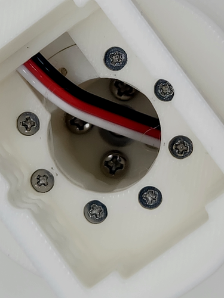

---

### 2.1.24. 숄더 링크용 서보 장착 (24.png)

2번째 서보모터(ID 2)를 숄더 링크에 고정합니다.

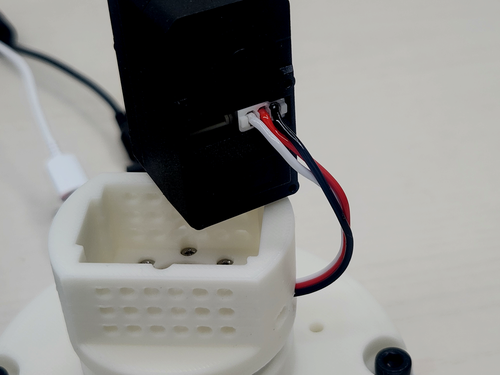

---

### 2.1.25. 서보 방향 확인 (25.png)

숄더 링크용 서보는 4개의 나사만 사용합니다.

PC로 가는 시리얼 케이블과 숄더 링크의 시리얼 케이블 구멍이 같은 쪽이어야 조립이 올바르게 된 것입니다.

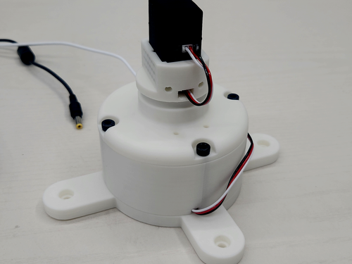

---

### 2.1.26. 숄더 링크 서보 나사 체결 (26.png)

그림과 같이 숄더 링크용 서보모터의 나사를 고정합니다.

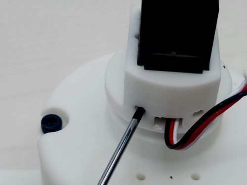

---

### 2.1.27. 숄더 링크 후면 확인 (27.png)

숄더 링크와 서보모터가 고정된 후면 모습입니다.

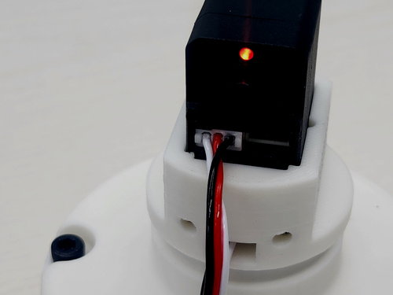

---

### 2.1.28. 숄더 서보 2047 위치와 서보혼 방향 확인 (28.png)

숄더용 서보모터도 2047 위치여야 하며, 서보혼의 위치도 그림과 같아야 합니다.

약간 옆으로 돌아가 보이는 것은 서보모터 톱니와 서보혼을 기계적으로 완벽하게 정렬하기 어렵기 때문입니다.

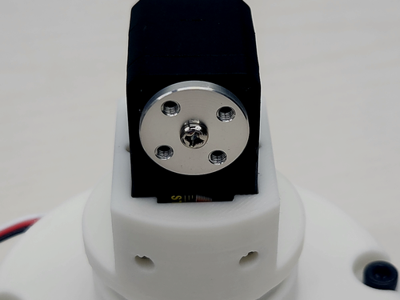

---

## 암 링크 조립

### 2.1.29. arm1을 서보혼에 고정 (29.png)

이번에는 arm1을 조립합니다. STS3215 서보혼에 arm1 기구물을 직접 M3x6 볼트로 고정합니다.

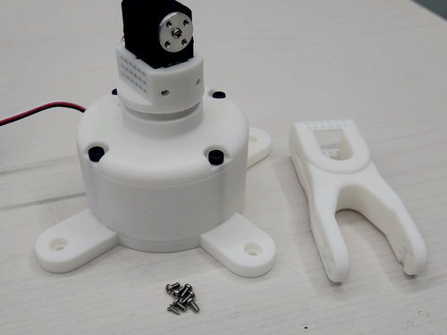

---

### 2.1.30. 숄더와 arm1 결합 후면 확인 (30.png)

숄더와 arm1 결합 후면 모습입니다.

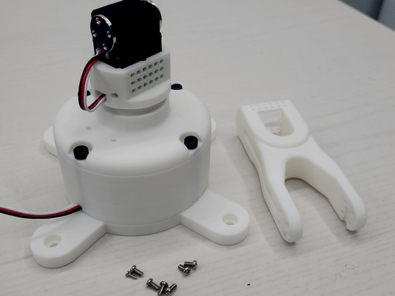

---

### 2.1.31. arm1 방향 맞춰 조립 (31.png)

그림과 같이 숄더 서보모터와 arm1 기구물을 조립합니다. arm1 기구물 측면에 길게 홈이 파인 부분이 서보모터 시리얼 케이블 연결부와 같은 쪽이 되도록 방향을 맞추세요.

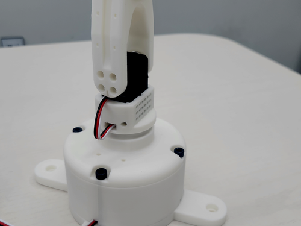

---

### 2.1.32. M3x6 나사 체결 (32.png)

서보 패키지에 있는 M3x6 나사를 체결합니다. 힘이 많이 받는 부분이므로 4개 나사를 모두 사용해 단단히 고정해야 합니다.

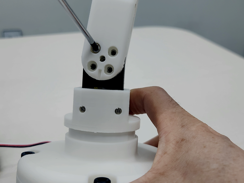

---

### 2.1.33. arm1용 서보 준비 (33.png)

숄더 서보와 arm1의 조립이 끝났다면, arm1용 서보모터(ID 3)를 준비합니다.

일관되게 서보모터의 시리얼 케이블 연결부는 모두 같은 면을 향해야 하며, 조립 전에 서보모터 ID 3도 2047 위치로 맞춥니다.

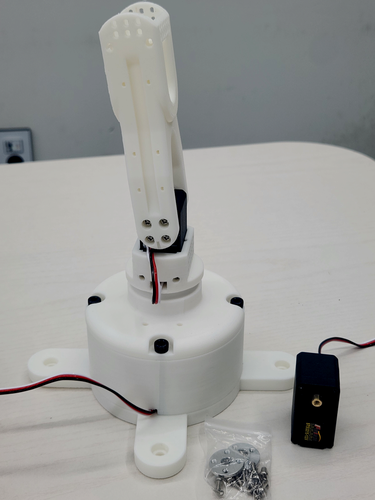

---

### 2.1.34. arm2용 서보를 arm1 상단에 장착 (34.png)

arm2용 서보모터를 arm1 상단에 장착합니다.

그림에서 arm1이 약간 기울어져 보일 수 있는데, 이는 서보혼이 기계적인 이유로 미세하게 회전한 상태로 결합되기 때문이며, 나중에 오프셋 조정으로 원점에서 일직선이 되도록 맞춥니다.

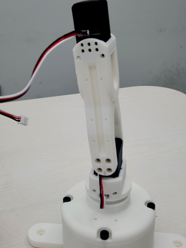

---

### 2.1.35. arm2용 서보 고정 (35.png)

M2x6 나사로 서보를 고정합니다.

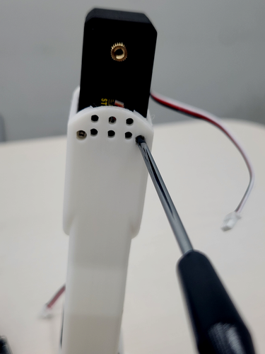

---

### 2.1.36. 서보혼 방향 맞추기 (36.png)

서보혼을 가능하면 그림과 같은 모양이 되도록 장착합니다.

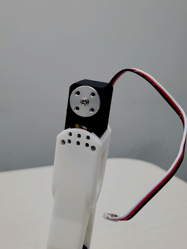

---

### 2.1.37. 숄더 서보와 arm1 서보 케이블 연결 (37.png)

숄더 서보와 arm1 서보를 시리얼 케이블로 연결합니다.

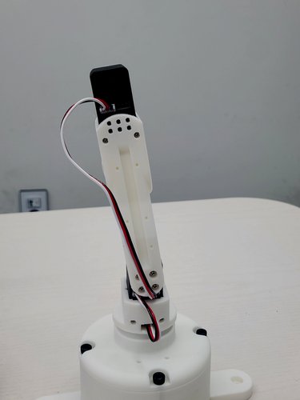

---

### 2.1.38. arm2 기구물 조립 (38.png)

이번에는 arm1 서보에 arm2 기구물을 조립합니다.

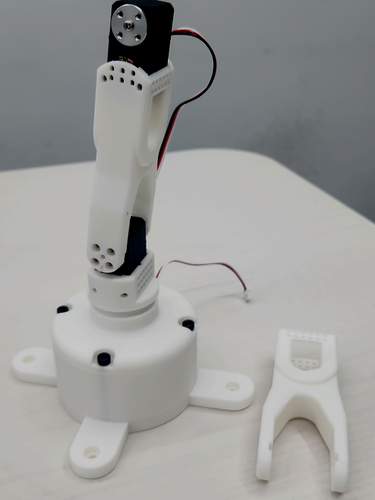

---

## 리스트 모듈 조립

### 2.1.39. wrist_link 조립 준비 (39.png)

이번에는 wrist_link를 조립할 차례입니다.

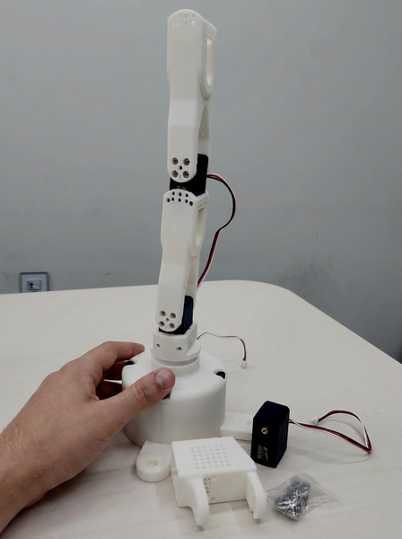

---

### 2.1.40. 서보 ID 4 조립 (41.png)

서보모터 ID 4를 그림과 같이 조립합니다.

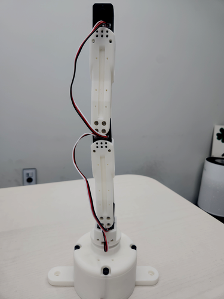

---

### 2.1.41. arm2용 서보혼 장착 (42.png)

arm2용 서보모터(ID 4)에 서보혼을 그림과 같이 조립합니다.

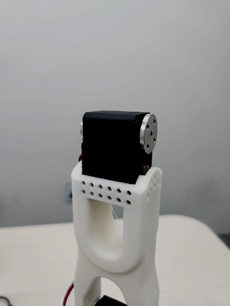

---

### 2.1.42. wrist_link 모듈 조립 시작 (43.png)

그 다음에는 wrist_link 모듈을 조립합니다. 이 기구물의 특성상 서보모터와 케이블을 먼저 조립해야 합니다.

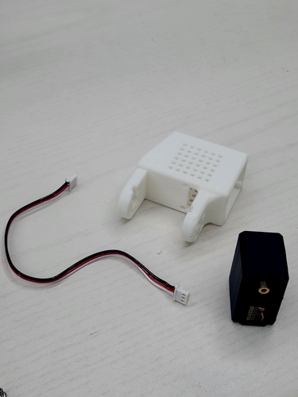

---

### 2.1.43. 서보 ID 5를 2047 위치로 맞춰 장착 (44.png)

서보(ID 5)를 2047 위치로 맞춘 뒤 조립합니다.

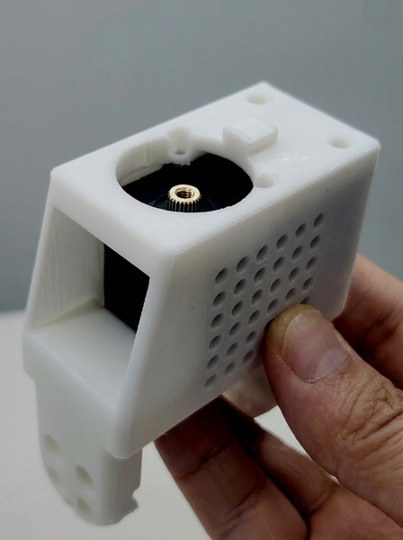

---

### 2.1.44. wrist_link 서보 케이블 연결 (45.png)

wrist_link 모듈에 서보모터 시리얼 케이블을 연결합니다. 나중에 조립이 어려우므로 2개의 케이블을 모두 연결합니다.

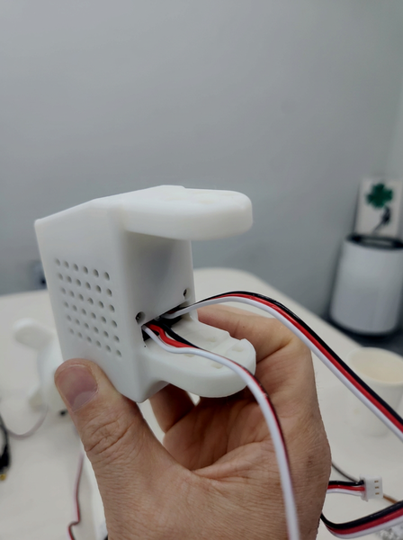

---

### 2.1.45. 서보혼 장착 (46.png)

이후에는 서보혼을 그림과 같이 조립합니다. 먼저 서보 ID 5를 2047에 맞추어야 합니다.

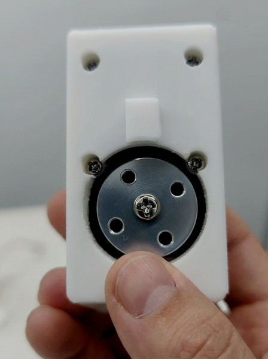

---

### 2.1.46. wrist_link를 arm1 서보에 연결 (47.png)

wrist_link를 arm1용 서보에 연결합니다.

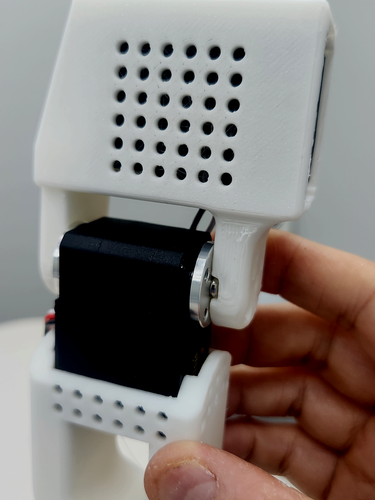

---

### 2.1.47. wrist_link 조립 완료 (48.png)

M3x6 나사를 체결하여 wrist_link 조립이 완성된 모습입니다.

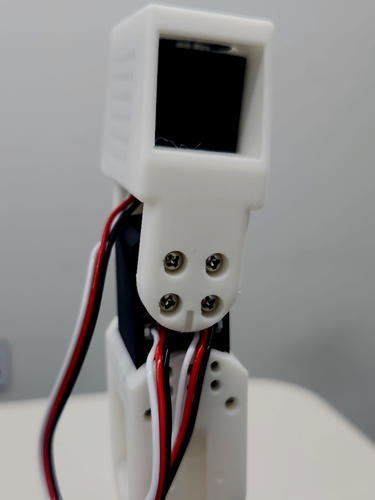

---

## 그리퍼 베이스 조립

### 2.1.48. 그리퍼 베이스 모듈 조립 준비 (49.png)

이번에는 그리퍼 베이스 모듈을 조립합니다. 여기에 사용되는 서보는 ID 6입니다.

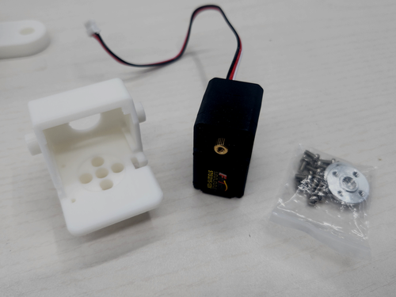

---

### 2.1.49. 그리퍼 베이스 선조립 (51.png)

그리퍼 베이스를 그림과 같이 먼저 조립합니다. 그리퍼 베이스는 wrist_link에 돌기가 있어서 반드시 그림과 같은 방향으로 조립해야 합니다.

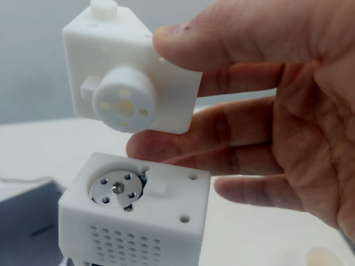

---

### 2.1.50. wrist_link와 gripper_base 결합 (54.png)

wrist_link와 gripper_base를 조립하면 그림과 같은 형태가 됩니다. gripper base의 경우 서보모터를 먼저 조립하면 안 됩니다.

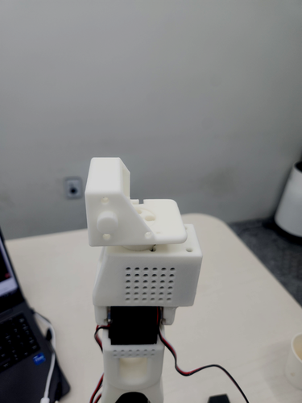

---

### 2.1.51. 서보 ID 6 장착 및 케이블 연결 (55.png)

이제 서보 ID 6을 조립하고 시리얼 케이블도 연결합니다.

---

## 그리퍼 조립 및 마무리

### 2.1.52. 그리퍼 부품 준비 (56.png)

마지막으로 그리퍼를 조립합니다.

1. gripper_left
2. gripper right cover
3. gripper right main
4. gripper left용 베어링 2개
5. M2x6 나사 2개

---

### 2.1.53. right main과 right cover에 베어링 결합 (57.png)

gripper right main과 gripper right cover에 베어링을 결합합니다.

---

### 2.1.54. 그리퍼 베이스에 right 모듈 조립 (58.png)

그리퍼 베이스에 gripper right main과 gripper right cover를 조립합니다.

---

### 2.1.55. 그리퍼 베이스 서보혼 각도 설정 (59.png)

gripper base 서보모터 ID 6에 서보혼을 연결합니다. 서보혼의 각도는 그림과 가능한 한 유사하게 맞춰야 합니다.

그리퍼의 원점은 다음 그림과 같으므로, 이 상태를 기준으로 서보혼 각도를 잡아야 합니다.

---

### 2.1.56. gripper left 조립 및 기어 맞물림 확인 (60.png)

이제 gripper left를 조립합니다. 이미 장착된 gripper right 모듈은 기어가 서로 맞물려 돌아가므로, gripper left와 gripper right의 기어가 잘 맞물리도록 조립합니다.

그리퍼의 각도가 그림과 같으면 이것이 원점입니다. 어느 정도 허용범위가 있으므로 그림과 비슷하게 조립한 뒤, 필요하면 나중에 오프셋으로 보정합니다.

---

### 2.1.57. 그리퍼 케이블 정리 (61.png)

그리퍼 동작 중 서보모터 ID 6의 시리얼 케이블이 겹치지 않도록 케이블을 정리합니다.

---

### 2.1.58. 조립 완료 및 다음 단계 안내 (62.png)

이렇게 해서 조립이 완료되었습니다. 다음 단계는 로봇암의 원점 상태에서 원점 오프셋을 파악하는 것입니다.

---
